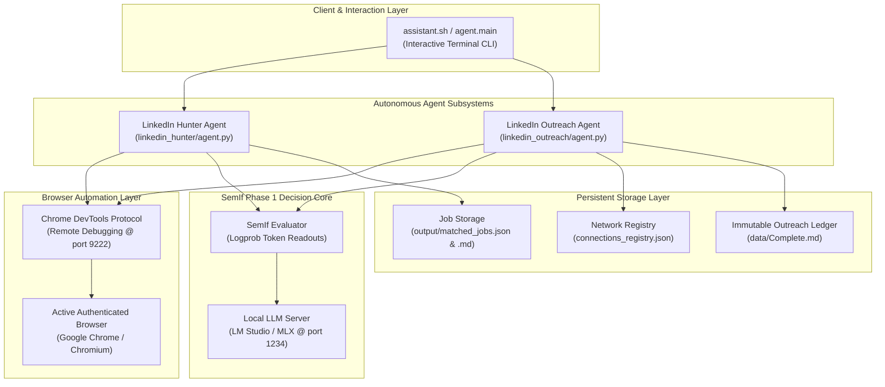

# ⚡ Jev AI Platform: Autonomous LinkedIn Job Hunter & Network Outreach Engine

An end-to-end autonomous agentic system powered by **SemIf Phase 1** (sub-millisecond semantic decision engine) and Chrome DevTools Protocol (CDP) browser automation.

The platform unifies three core subsystems:
1. **Autonomous LinkedIn Job Hunter (`linkedin_hunter/`)**: Intelligent search across job listings and newsfeed hiring posts, 4-axis qualification scoring, and automated reporting.
2. **Autonomous LinkedIn Network Outreach Agent (`linkedin_outreach/`)**: Incremental delta-sync pipeline that discovers newly added 1st-degree connections, evaluates persona relevance, verifies message history, and dispatches personalized outreach.
3. **SemIf Phase 1 Decision Backend (`backend/`)**: Sub-millisecond logprob-based classification server and OpenAI-compatible proxy (`port 8090` / `8080`) that replaces slow, non-deterministic generative LLM calls with exact decision boundaries.

---

## 🏗 System Architecture



---

## 📁 Repository Structure

```text
jev-api/
├── assistant.sh                      # Universal interactive CLI launcher
├── Mushfiq_Kabir_CV.json             # Structured resume & skills profile
├── agent/                            # Unified CLI assistant module
│   ├── __init__.py
│   └── main.py                       # Interactive multi-agent menu interface
├── backend/                          # SemIf Phase 1 Semantic Decision Core
│   ├── pyproject.toml                # Package configuration (semif-phase1)
│   ├── src/semif_phase1/             # Core decision engine & servers
│   │   ├── cli.py                    # Direct CLI scoring tool
│   │   ├── core.py                   # Mathematical logprob decision engine
│   │   ├── direct.py                 # Fast direct readout pipeline
│   │   ├── jev_server.py             # OpenAI-compatible choice server (port 8090)
│   │   ├── reranker.py               # Candidate cross-entropy reranker
│   │   ├── server.py                 # Interactive test UI (port 8080)
│   │   └── typesafe_proxy.py         # Schema-validated logprob proxy
│   ├── tests/                        # Backend test suite (53 tests)
│   └── benchmarks/                   # Model performance & perturbation benchmarks
├── linkedin_hunter/                  # Autonomous Job Hunter Subsystem
│   ├── agent.py                      # Unified Hunter Agent CLI
│   ├── browser.py                    # CDP browser controller & extraction
│   ├── config.py                     # Hunter environment variable parser
│   ├── cv_loader.py                  # Resume profile parser
│   ├── evaluator.py                  # Job & candidate fit scoring engine
│   ├── hunt_core.py                  # Decoupled hunting state machine
│   ├── hunter.py                     # Search & feed execution entrypoint
│   ├── judgments.py                  # 4-axis weighted scoring rubrics
│   ├── storage.py                    # JSON, Markdown, and CSV persistence
│   ├── triage.py                     # Post-match next actions & opener generator
│   ├── output/                       # Output artifacts (matched_jobs.json, jobs_report.md)
│   └── tests/                        # Hunter test suite (15 tests)
├── linkedin_outreach/                # Autonomous Connection Outreach Subsystem
│   ├── agent.py                      # Unified Outreach Agent CLI
│   ├── data/
│   │   ├── Complete.md               # Append-only ledger of messaged connections
│   │   ├── connections_registry.json # Fast O(1) delta-sync state registry
│   │   └── message.py                # Personalized message templates
│   ├── outreach/
│   │   ├── browser.py                # `browser-use` CLI runner (CDP automation)
│   │   ├── config.py                 # Outreach configuration parser
│   │   ├── core.py                   # Runner abstraction
│   │   ├── dispatch.py               # Message sender & thread detection
│   │   ├── evaluator.py              # Candidate relevance scoring (BM25 + SemIf)
│   │   ├── harvest.py                # Connection link extraction scripts
│   │   ├── ledger.py                 # Append-only markdown tracker
│   │   ├── messaging.py              # Dynamic template formatter
│   │   ├── names.py                  # Name parsing and normalization
│   │   ├── pipeline.py               # End-to-end sync & send pipeline
│   │   ├── progress.py               # Sent-today / progress snapshot writer
│   │   ├── registry.py               # Fast JSON registry manager
│   │   └── sync.py                   # Incremental network synchronizer
│   └── tests/                        # Outreach test suite (59 tests)
```

---

## 🛠 Prerequisites

1. **Operating System**: Linux, macOS, or Windows (WSL2).
2. **Python**: Python 3.10+ (virtual environment recommended).
3. **Local LLM Server (LM Studio / MLX / vLLM)**:
   - Must expose an OpenAI-compatible API at `http://localhost:1234/v1`.
   - Default model: `qwen3.5-4b` (or any model supporting logprobs).
4. **Active Google Chrome or Chromium Browser**:
   - Started with remote debugging or active DevTools:
   ```bash
   google-chrome --remote-debugging-port=9222 &
   ```
5. **`browser-use` CLI on `PATH`**: The outreach agent drives the attached browser through this external CLI. The job hunter instead uses Playwright from `linkedin_hunter/.venv`, which `assistant.sh` prefers when it exists.

---

## 🚀 Quick Start

### 1. Launch Universal Terminal Assistant

The fastest way to access all agent operations:

```bash
./assistant.sh
```

This launches the interactive multi-agent control console:
```text
===============================================================
       🎯 Mushfiq's Autonomous LinkedIn Job Hunter Agent
===============================================================
  1. 🔍 Hunt LinkedIn Jobs (Search + Feed Fallback)
  2. 📰 Scan LinkedIn Feed Directly (Hiring Posts)
  3. 📄 View Matched Jobs Report (.md)
  4. 🔑 Login to LinkedIn (Save Browser Session)
  5. 🧠 Triage Matched Jobs (next actions + recruiter openers)
  6. 💬 Run LinkedIn Network Outreach (Autonomous SemIf DM Agent)
  0. 🚪 Exit
===============================================================
```

---

### 2. Run the LinkedIn Job Hunter CLI

```bash
# Run using the unified agent CLI (reads defaults from .env):
python3 -m linkedin_hunter.agent

# Custom search: Target 10 remote design roles posted this week:
python3 -m linkedin_hunter.agent --query "UI/UX Designer" --work-type remote --recency week --min-matches 10

# Scan the LinkedIn News Feed directly for hiring opportunities:
python3 -m linkedin_hunter.agent --feed-only --min-matches 10
```

---

### 3. Run the LinkedIn Network Outreach Agent

```bash
# Dry-run simulation (verifies delta sync, scores candidates, previews messages; no sends, no thread checks, no ledger writes):
python3 -m linkedin_outreach.agent --dry-run

# Live outreach run (delivers messages up to daily safety limit):
python3 -m linkedin_outreach.agent --limit 15

# Sweep 1st-degree People Search directly:
python3 -m linkedin_outreach.agent --search-only --start-page 1 --max-pages 20
```

---

### 4. Run SemIf Decision Services

```bash
# Start SemIf Choice Server on port 8090:
python3 -m semif_phase1.jev_server --port 8090

# Start SemIf Interactive Visual Calibrator on port 8080:
python3 -m semif_phase1.server --port 8080
```

---

## ⚙️ Configuration Reference (`.env`)

Both agents automatically load configuration from `.env` files.

### LinkedIn Job Hunter Settings (`linkedin_hunter/.env`)

| Variable | Default | Description |
|---|---|---|
| `DAILY_TARGET_MATCHES` | `10` | Target number of matching jobs to find before halting (`DEFAULT_MIN_MATCHES` is the fallback alias) |
| `DEFAULT_MIN_SCORE` | `70` | Minimum percentage score (0–100) required to save a job |
| `FEED_MIN_SCORE` | `65` | Minimum percentage score for a feed post to count as a matching lead |
| `DEFAULT_MAX_PAGES_PER_QUERY` | `2` | Maximum search result pages to paginate per query before rotating |
| `DEFAULT_JOB_LIMIT` | `50` | Maximum raw job postings to inspect per query |
| `DAILY_EVALUATE_CAP` | `120` | Maximum evaluations per run (only enforced with `--enforce-caps`) |
| `DEFAULT_QUERIES` | `UI/UX Designer, Product Designer, …` | Comma-separated query rotation list |
| `ENABLE_HUMAN_DELAYS` | `0` (False) | When `0`, eliminates all artificial sleep pauses for maximum execution speed |
| `HUMAN_DELAY_MIN` | `0.0` | Minimum random navigation pause in seconds |
| `HUMAN_DELAY_MAX` | `0.0` | Maximum random navigation pause in seconds |
| `CARD_CLICK_DELAY_MIN` | `0.0` | Minimum pause before clicking job cards |
| `CARD_CLICK_DELAY_MAX` | `0.0` | Maximum pause before clicking job cards |
| `CHROME_CDP_URL` | `http://localhost:9222` | CDP endpoint used to attach to your existing Chrome session |
| `LLM_BASE_URL` | `http://localhost:1234/v1` | Local LLM server endpoint (falls back to `SEMIF_REMOTE_BASE_URL`) |
| `LLM_MODEL` | `qwen3.5-4b` | Model identifier used for semantic logprob evaluation (falls back to `SEMIF_REMOTE_MODEL`) |

> Feed scrolling is controlled by the `--max-feed-scrolls` CLI flag (default `80`), not an `.env` key.

### LinkedIn Network Outreach Settings (`linkedin_outreach/.env`)

| Variable | Default | Description |
|---|---|---|
| `TOP_N` | `25` | Target batch size of uncontacted candidates to maintain in the working pool |
| `DAILY_LIMIT` | `15` | Maximum number of direct messages to send per calendar day |
| `PACING` | `0` | Base delay in seconds between message dispatches (`0` = no delay) |
| `PACING_JITTER` | `0` | Multiplier bounding the randomized pacing delay (`PACING`–`PACING × JITTER`) |
| `MAX_ATTEMPTS` | `2` | Retry attempts for a transient delivery failure (an `UNKNOWN` outcome is never retried) |
| `PAUSE` | `0` | Seconds to wait between network sync and dispatch for manual review |
| `THREAD_CHECK` | `1` | Inspect the live conversation DOM for existing messages before sending |
| `THREAD_CHECK_STRICT` | `0` | When `1`, skip the contact if the thread check is inconclusive instead of sending |
| `SEMIF_ENABLED` | `1` | Use SemIf logprob scoring for archetype/relevance (heuristic fallback when `0` or unreachable) |
| `SEMIF_BASE_URL` | `http://localhost:1234/v1` | LM Studio endpoint used by the SemIf scorer |
| `SEMIF_MODEL` | `qwen3.5-4b` | Model identifier used for SemIf scoring |
| `MIN_RELEVANCE_SCORE` | `50` | Minimum relevance score (0–100) required to send a message |
| `FILTER_LOW_RELEVANCE` | `1` | When `0`, send regardless of `MIN_RELEVANCE_SCORE` |
| `DRY_RUN` | `0` | When `1`, simulate the run without sending messages or writing the ledger |
| `SEARCH_ONLY` | `0` | When `1`, skip the connections page and sweep People Search directly |
| `START_PAGE` | `1` | First People Search page to sweep during network synchronization |
| `MAX_PAGES` | — | Maximum People Search pages to sweep (unset falls back to `SEARCH_MAX_PAGES`) |
| `SEARCH_MAX_PAGES` | `50` | Fallback page bound used when `MAX_PAGES` is unset |
| `BU_TIMEOUT` | `180` | Seconds before a hung `browser-use` call is killed |
| `LINKEDIN_CONNECTIONS_URL` | `https://www.linkedin.com/mynetwork/invite-connect/connections/` | Connections page the delta-sync scans |
| `PORTFOLIO_URL` | `https://mushfiqkabiruix.vercel.app/` | Portfolio URL injected into message templates |

---

## 🔒 Safety, Delta-Sync & Ledger Architecture

1. **Non-Invasive Browser Attachment**:
   - The agents attach directly to your existing browser session over **Chrome DevTools Protocol (CDP)** on port `9222`.
   - No separate automation browser profiles or telltale `navigator.webdriver` flags are used.
2. **$O(1)$ Delta-Sync Registry (`connections_registry.json`)**:
   - Remembers all synchronized connections and their status (`messaged`, `skipped`, `pending`).
   - Enables instant $O(1)$ verification without visiting candidate profiles or opening message windows.
3. **Immutable Append-Only Ledger (`Complete.md`)**:
   - Every sent message is recorded with a permanent timestamp and profile URL in `linkedin_outreach/data/Complete.md`.
   - Never modified or truncated by the system.
4. **Thread-Level History Verification**:
   - Before typing any message, the agent inspects the conversation DOM. If outbound messages already exist in the thread, it aborts dispatch and marks the candidate as already contacted.

---

## 🧪 Testing & Verification

The repository contains 127 automated tests across all subsystems:

```bash
# Run SemIf backend test suite (53 tests):
pytest backend/tests

# Run LinkedIn Hunter test suite (15 tests):
pytest linkedin_hunter/tests

# Run LinkedIn Outreach test suite (59 tests):
python3 -m unittest discover linkedin_outreach/tests
```

---

## 📄 License

This repository is distributed under the MIT License. See [LICENSE](backend/LICENSE) for details.
