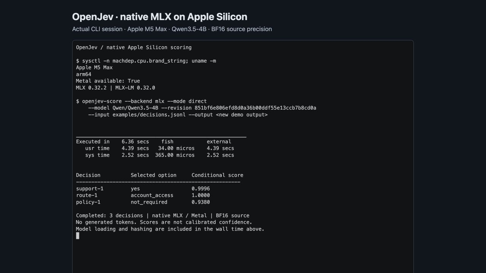

# Apple Silicon CLI capture (archived)

[Download the terminal recording](openjev-mlx.cast) and replay it with
`asciinema play openjev-mlx.cast`. This is an asciicast v2 recording of the
actual process output and timing, not a simulated terminal animation. The PNG
is a browser screenshot of the completed recording in asciinema-player 3.17.0.

Captured on 2026-09-17 with an Apple M5 Max, 128 GiB unified memory, Metal,
MLX 0.32.2, and pinned MLX-LM 0.32.0. The code under test was commit
`56e7ce2a38214137f476d2444e9193f72dcbb4ab`. The recording retains the former
OpenJev name and command.

The fixture is `examples/decisions.jsonl`. The actual CLI output is retained in
[openjev-mlx-results.jsonl](openjev-mlx-results.jsonl), including model revision,
source hashes, probabilities, and timing metadata. The small displayed table
selects the largest recorded probability for each row; it is presentation of
the saved output, not additional inference. `1.0000` is rounded to four decimals.

This is a historical capture only: the Apple Silicon backend and its benchmark
tooling were removed, so the recorded command no longer runs against the current
checkout. The measured output is kept for provenance. The recorded 6.36-second
wall time includes loading and hashing; it is a CLI demonstration, not the
throughput benchmark. Conditional option scores are uncalibrated.
